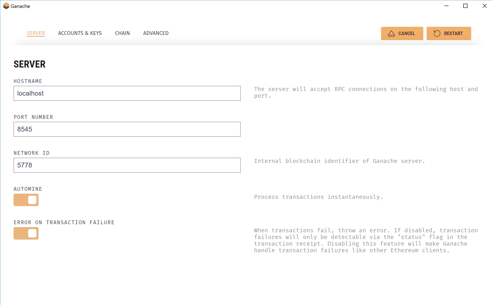
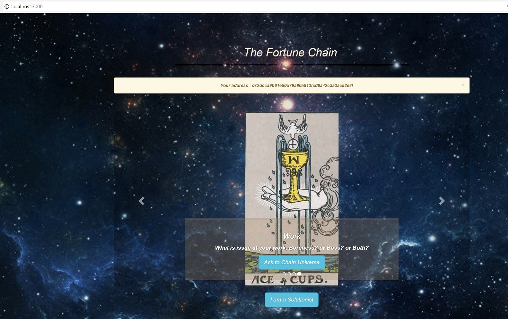
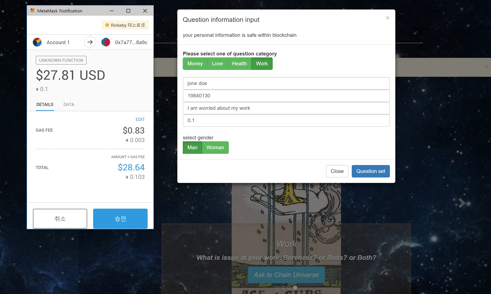
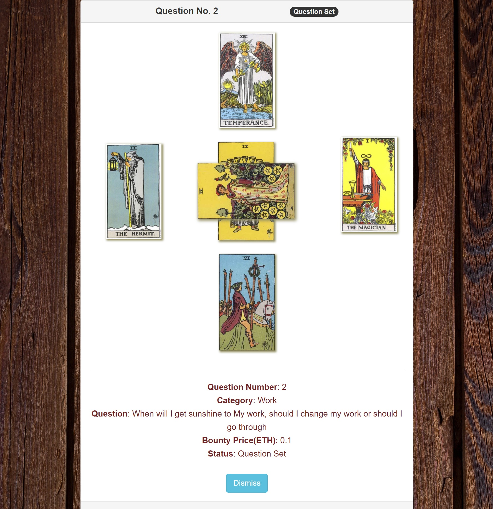
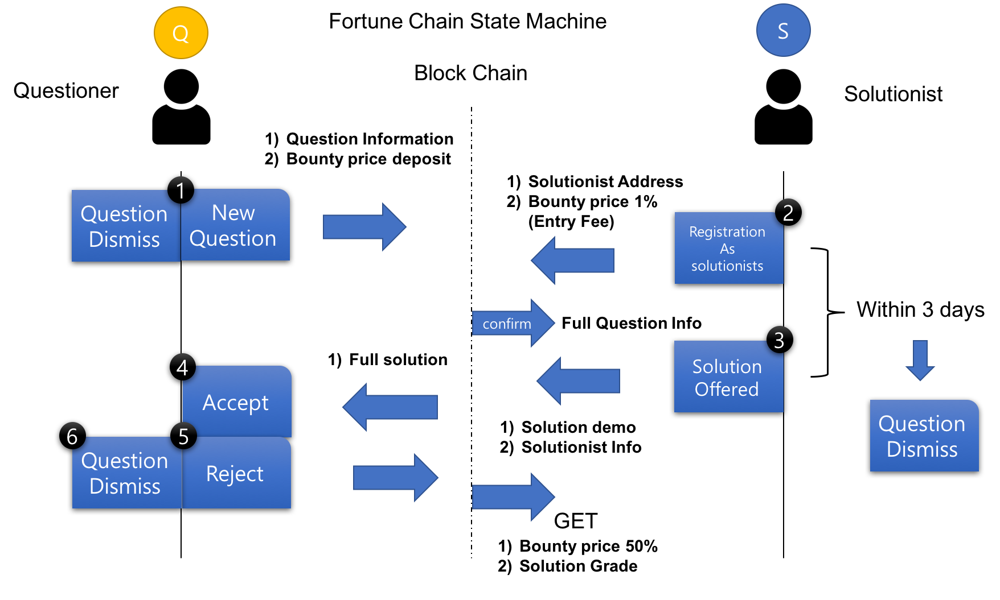

Fortune Chain
============

# 1.Introduction

Fortune Chain is Bounty question and solution system using tarot cards as a 
interface which is selected by calculated at smart contract.

1. advantage for using blockchain at this system
	1) private counselling
at this counselling, protecting customer information very critical issue, public question service remain foot stamp like Digital ID. Customers can get the solutions without expose their personal information. Due to personal information is saved within encrypted at blocks,
	2) reliability 
solutionist information and grade is also saved at blocks. It is hard to cheating for modifying reputation of solutionists. And solution service fee is in smart contract. Therefore it is easy to guarantee for the service fee and solution delivery. Even you can ask to famous fortune teller from opposite side on earth. 
	3) block chain calculate my future
your information is combined block information and it can output by the numbers. Following numerology, all number has special meanings. 
Tarot card has 78 cards within number and character and symbols. It is most famous and interesting counselling tool. 
Block chain choose a number with mixed encrypted personal and block information. User interface web service will show you which card is chosen by blockchain within 6 cards (European caltic cross spread). These beautiful cards combinations interesting but you can not interpret by your self. Therefore solutionist is needed for this counselling. 

# 2.User story

I have a very important and unresolved question. I open fortune chain web site and input my name, date of birth, question category, and the question and gender. then I set bounty price for this question as 0.5 ETH. 
Then mystical 6 cards spread at the questions board. I will waiting for high grade and good solutionist would be applied at this question.
Oh, my question card status is changed set to solution pending. It means one of solutionist registered to my question. 

<In this time, solutionist has 3 days for offer solution. If this time expired, then questioner can be set question to dismissed (question canceled) but within this 3days, questioner can not canceled. >

my question card status changed again, finally solution is offered from registered solutionists. I click check button, there is part of full solutions. it is good start. The solutionist level and average grade is good. I clicked accept button then I get full solution, I read and checking with tarot card spread so it is more clear to what is meaning of this cards. Therefore I set the solution grade to 4/5 points 

# 4. how to get start 
download files, and 

in root directory 

## for start 
<pre><code>npm install</code></pre>

## set ganache network 
hostname: localhost

port :8545

network ID : 5778

MNEMONIC : shaft clap gun expire course crouch magnet furnace grant shop used vacant

## for run test
<pre><code>truffle test</code></pre>

## for run compile and migrate
<pre><code>truffle migrate --compile-all --reset --network ganache</code></pre>

## for open with user application
<pre><code>npm run dev</code></pre>

then open chrome with address 
http://localhost:3000

then you can see as below

### 1) input your questions and information and click button 'question set'

### 2) then you can see your question tarot card like below

### 3) login with other account and registration and send answer

### 4) login with first account then accept or reject

## it will progress as below state machine

# 5.State 

*questioner
1. for creating and setting new question, 
   then below is needed to do questioner
	1) input question information
	2) deposit bounty price

*solutionist
2. register a question as a solutionist
	1) pay 1% as a Entry fee.
Then, it is success to register then solutionist can get full question information
Solutionist should send full solution within 3 days. If not, questioner can  change to dismiss state.

3. solution is offered 

*questioner
 questioner can check solution demo and solutionist information (level and average weighted grade) 

4. questioner decide to accept or reject question
	1) if questioner click accept button
then your deposited bounty price is transfer to solutionist
and solutionist level is upgrade and questioner get full solution
	2) if questioner click reject button
then question status is back to like as set state. 
then the registered solutionist record is deleted   
	3) if questioner read full solution, then questioner can set solution grade. This is applied to weighted by bounty price 

5. questioner can dismiss within 3 situation 
	1)when question first set
	2)when 3 days after registered solutionist
	3) offered solution reject 

# 6. specification : requirement 

1. user interface
-> localhost:3000 

2. Test Requirements

testFortuneChain.js 
truffle test network --ganache
-> test scenario
1. contact owner check test
2. ganache second account -> set a new questione
3. ganache third account -> registry solutionist of 1st question 
4. ganache third account -> offer solution
5. ganache second account -> reject solution
6. ganache fourth account -> set a new question 
7. ganache fifth account -> registry solutionist of 2nd question 
8. ganache fifth account -> get full question information 
9. ganache fifth account -> offer solution
9. ganache fourth account -> accept solution 
10. ganache fourth account -> get full solution
11. ganache second account -> dismiss question

assert value check, all of event and return variable check

